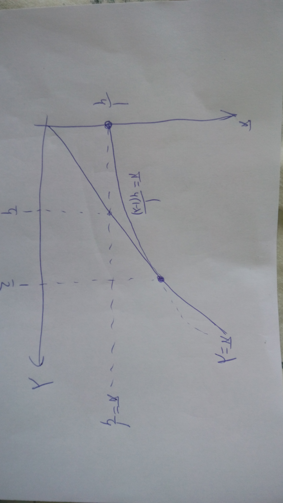

Рассмотрим разные ситуации: 

* франты и клерки покупают одинаковые костюмы
* франты и клерки покупают разные костюмы
* франты покупают, а клерки --- нет

Таки Вы посмотрите на этот мир, и Вы посмотрите на эти брюки!

* Франты и клерки покупают одинаковые костюмы. Главное чтобы клерки были согласны покупать, т.к. франты готовы платить больше. Чтобы клерки соглашались, костюм качества $q$ будет стоить $p=q$.

Портной максимизирует прибыль:

\[
\max q-C(q) = q-q^2
\]

Оптимальное предложение Портного: костюмы с $q=1/2$ стоят $p=1/2$. Прибыль Портного равна $1/4$.

* Франты покупают, а клерки --- нет. Чтобы франты соглашались покупать, костюм качества $q$ будет стоить $p=2q$.

Портной максимизирует прибыль:

\[
\max \lambda(2q-C(q)) = \lambda (2q-q^2)
\]

Оптимальное предложение Портного: костюмы с $q=1$ стоят $p=2$. Прибыль Портного равна $\lambda$.

* Франты и клерки покупают разные костюмы.

Клерки согласны покупать свои костюмы:

\[
q_k-p_k\geq 0
\]

Клерки не хотят покупать костюмы франтов:

\[
q_k-p_k \geq q_f - p_f
\]

Франты согласны покупать свои костюмы:
\[
2q_f-p_f\geq 0
\]

Франты не хотят покупать костюмы клерков:
\[
2q_f-p_f\geq 2q_k-p_k
\]

Условие (3) следует из (1) и (4), поэтому обойдемся без него.

Портной максимизирует

\[
\lambda(p_f-q_f^2)+(1-\lambda)(p_k - q_k^2)
\]

Ограничения можно переписать в виде: $p_f-p_k \in [q_f-q_k;2(q_f-q_k)]$, $q_k\geq p_k$. В частности, отсюда следует, что $q_f\geq q_k$, то есть костюм франтов лучше костюма клерков :)

Представим себе, что Портной обратился к Оптимизатору и узнал оптимальные $q_k$ и $q_f$ и сам думает над оптимальными ценами.

Портной хочет $p_f$ побольше, отсюда $p_f-p_k=2(q_f-q_k)$, $q_k\geq p_k$, $q_f\geq q_k$.

Портной хочет $p_k$ побольше, отсюда $p_k=q_k$, при этом $p_f$ само собой выходит больше нуля, $p_f=p_k+ 2(q_f-q_k)=2q_f-q_k$.

Получаем упрощенную задачу Портного:

\[
\max \lambda(2q_f-q_k-q_f^2)+(1-\lambda)(q_k-q_k^2)
\]
при этом осталось одно ограничение $q_f \geq q_k \geq 0$.

Забьем на ограничения и решим задачу оптимизации без ограничений. 

Получаем $q_f=1$, $q_k=(1-2\lambda)/(2-2\lambda)$. 

Значит, если $\lambda<1/2$, то всё само собой ок и $q_f=1$, $q_k=(1-2\lambda)/(2-2\lambda)$.

Если $\lambda \geq 1/2$, то $q_f=1$, $q_k=0$, то есть костюмы продаются только франтам, а мы ищем другой тип равновесия.

Находим прибыль Портного, получаем, что используя разделяющее равновесие, при $\lambda<1/2$ можно добиться прибыли $\frac{1}{4(1-\lambda)}$.

Рисуем картинку:

По картинке ищем максимум прибыли при разных $\lambda$:

При $\lambda < 1/2$ оптимален разделяющий контракт: $q_f=1$, $q_k=\frac{1-2\lambda}{2-2\lambda}$, $p_k=q_k=\frac{1-2\lambda}{2-2\lambda}$, $p_f=2q_f-q_k=2-q_k=\frac{3-2\lambda}{2-2\lambda}$.

При $\lambda > 1/2$ оптимально продавать только франтам, $p_f=1$, $q_f=2$.

При $\lambda=1/2$ две найденные опции приносят одинаковую прибыль Портному.

